# NOVA — a dynamic-island control center for Windows



NOVA puts a small animated notch at the top-center of your screen. It stays out of the way when nothing
is happening, and smoothly expands for music and synced lyrics, calls and messages from other apps, quick
apps, timers, a calculator, clipboard history, search and system events (volume, battery, network,
downloads). It runs in the background with a tray icon and a global shortcut, and comes with a full Fluent
settings app and a first-run tour.

## Download

Grab `NOVA-win-Setup.exe` (per-user install, no admin needed) or the portable zip from the
[Releases](../../releases) page. Windows 10 2004 or later; Windows 11 recommended.

## Highlights

- **The notch:** a per-pixel transparent overlay. It is always on top, never takes focus, and lets clicks
  through everywhere outside its shape. The default shape hangs from the screen edge with soft concave
  "shoulders"; a floating pill is the alternative.
- **States:** hidden, idle, hover, live activity (media or timer), expanded home, media player, quick apps,
  tools and notifications. A single state machine (`NotchStateMachine`) drives them all.
- **Six animation themes:** Liquid, Glass, Elastic, Minimal, Morph and Aurora. They run on an analytic
  spring engine that is time-based, so motion is identical at 60, 120 or 240 Hz; 120 fps was measured on a
  120 Hz display. Settings cover speed, intensity, spring strength, duration and Reduce Motion (which can
  follow the Windows setting). Every theme has a live preview in Settings and in onboarding.
- **Media:** Spotify, Chrome and every other app that publishes a Windows media session (Edge, Firefox,
  Media Player, VLC…). It uses the GSMTC API and is fully event-driven. You get artwork with a matching
  accent color, a live progress bar with seeking, play/pause/next/previous and per-app volume.
- **Synced lyrics:** the current line follows the song, fetched from [lrclib.net](https://lrclib.net) (free,
  no account). Only the track's title, artist, album and duration are sent, and results are cached. It
  can be turned off in Settings → Media.
- **Calls and messages:** notifications from other apps (WhatsApp, Messenger, browsers…) appear in
  the notch with the app icon, sender and text, and incoming calls stay up while they ring. Open jumps to
  the app. Windows asks once for permission to read notifications, and the message text can be hidden. Windows doesn't let one app press another app's notification buttons, so
  answering or replying happens in the app itself.
- **Multi-monitor:** four modes (Primary, Selected, Active window, Mouse). The app is Per-Monitor-V2 DPI
  aware and places the window in physical pixels. A selected monitor is remembered by its hardware path,
  survives unplugging (falls back to primary), and the notch re-places itself after DPI, resolution, sleep
  or layout changes.
- **Quick apps:** taken from the Start menu (Win32, Store and PWA apps, with real icons), any .exe/.lnk,
  folders or websites. You can rename them, reorder them (drag or arrows), give them custom icons and
  per-app global shortcuts. First run seeds only favorites that are actually installed.
- **Extras:** a timer (a live activity that survives sleep), a calculator (safe parser, keyboard or
  keypad), clipboard history (memory only, honors password-manager opt-outs), web or Windows search, a
  volume indicator (scroll over the notch to change the volume), brightness (laptop panels), battery,
  network and finished downloads.
- **Windows integration:** tray menu, start with Windows (HKCU Run key with Task Manager status),
  auto-hide in fullscreen games, videos and presentations, optional hiding from screenshots and
  recordings, single instance, and safe settings (atomic writes, backups, corrupt-file recovery).

## Requirements

- Windows 10 2004 (19041) or later; Windows 11 recommended (Mica, rounded corners).
- To build: .NET 8 SDK. Visual Studio is not required.

## Build & run

```powershell
dotnet build Nova.sln -c Release
src\Nova.App\bin\Release\net8.0-windows10.0.22621.0\win-x64\NOVA.exe
```

Command-line switches:

| Switch | Effect |
| --- | --- |
| `--background` | Start silently (what the Windows startup entry uses) |
| `--settings` | Open settings (a second launch while NOVA runs does this by default) |
| `--onboarding` | Run the first-run tour again |
| `--quit` | Tell the running instance to exit |
| `--reset-settings` | Start with default settings |
| `--debug <command>` | Developer commands (requires Settings → Advanced → Debug mode), e.g. `--debug state media`, `--debug perf`, `--debug notify Title|Subtitle` |

## Package (installer)

```powershell
./installer/build.ps1 -Version 1.0.0
```

This runs the tests, publishes a self-contained ReadyToRun build and creates `artifacts/releases/` with a
`Setup.exe` installer (per-user, no admin), a portable zip and Velopack update packages. Uninstalling
removes the startup entry.

## Where things live

| What | Where |
| --- | --- |
| Settings | `%APPDATA%\NOVA\settings.json` (plus `.bak`; corrupt files are kept as `settings.corrupt-*.json`) |
| Logs | `%LOCALAPPDATA%\NOVA\logs\nova-YYYYMMDD.log` (7 days) |
| Startup entry | `HKCU\Software\Microsoft\Windows\CurrentVersion\Run\NOVA` |

## Architecture

```
src/Nova.Core       Pure .NET (no UI, no P/Invoke): settings model + store, event bus, state machine,
                    layout table, spring solver, animation themes/profiles/animator, monitor selection
                    and DPI math, media abstraction + manager, quick-app launcher, hotkeys, calculator,
                    timer, clipboard history, notification routing, startup manager.
src/Nova.Platform   Windows implementations: monitors (EnumDisplayMonitors + DisplayConfig names/IDs),
                    WinEvent foreground tracking + fullscreen detection, RegisterHotKey, Run-key registry,
                    GSMTC media hub + Spotify/Chrome/Windows providers, CoreAudio volume (NAudio), WMI
                    brightness, WinRT power/network, clipboard listener, downloads watcher, shell icons
                    and the AppsFolder scanner, DWM backdrop blur.
src/Nova.App        WPF app: composition root (AppHost), notch window/controller/renderer/views, tray,
                    settings window (WPF-UI), onboarding, live previews.
tests/Nova.Tests    xUnit: 177 unit tests + 2 integration tests against the real Windows APIs.
```

Notch flow: inputs (pointer, hotkey, media, events, fullscreen) go to `NotchStateMachine`, whose
`NotchSnapshot` maps through `NotchLayout` to a target geometry. `NotchAnimator` animates the springs with
the theme's choreography, and `NotchSurface` renders the shape, material, glow, ambient light and specular
effects, while `NotchController` swaps the content view at the right moment. `FrameClock` only hooks the
render loop while something moves.

Adding a media source means subclassing `HubMediaProvider` (or implementing `IMediaProvider`). Adding an
animation theme means adding an `AnimationThemeDefinition`.

## Performance (measured, Release build, 16-core desktop, 120 Hz)

| Scenario | CPU (of one core) | Notes |
| --- | --- | --- |
| Idle / hidden | ~0.1 % | No timers or render loop |
| Live media indicator with animated equalizer | ~3 % | 20 fps, window shrunk to the notch; turn off "Animated equalizer" for ~0 % |
| Animations | display refresh rate | 120 fps measured |
| Memory | ~110–180 MB working set | Settings/WPF-UI are loaded only when opened; memory is trimmed after closing them |

## Testing

`dotnet test` runs everything, including integration tests that need Windows. GitHub Actions runs the unit
tests on every push and pull request with `--filter "Category!=Integration"`.

## Releasing

Push a version tag and the Release workflow builds the installer and publishes a GitHub release:

```powershell
git tag v1.0.0
git push origin v1.0.0
```

Automated coverage includes:

- settings round-trip, backup, corruption recovery and migration
- monitor selection on simulated 1-, 2- and 3-monitor layouts at 100/125/150/200%, including negative
  coordinates, disconnect/reconnect and identical models
- DPI placement math
- every state machine transition, the notification queue, coalescing and preemption
- springs (frame-rate independence, stability, overshoot) and every theme's characteristic motion
- media manager event logic and provider failure
- launcher validation and start info
- hotkey parsing and conflicts
- startup registry states
- tray menu structure and commands
- calculator, timer and clipboard

### Manual test checklist (hardware-dependent)

These need physical setups that automated tests can't reproduce:

- [ ] Two and three monitors in every Monitor mode; drag a window between monitors in Active mode.
- [ ] Mixed scaling (e.g. 150% laptop + 100% external): the notch stays centered and crisp when it moves.
- [ ] Change scaling or resolution while NOVA runs.
- [ ] Unplug the selected monitor (falls back to primary), then re-plug it (returns).
- [ ] Laptop: brightness keys show the indicator; plug/unplug the charger; low battery.
- [ ] Sleep/wake: media, monitor and timer resume correctly.
- [ ] Fullscreen game, F11 browser video and PowerPoint slideshow: the notch hides and returns.
- [ ] Spotify and Chrome (YouTube): artwork, controls, seeking and app volume.
- [ ] Restart Windows with "Launch NOVA when Windows starts" on: starts silently.

## Honest limitations

- **No real blur of the desktop behind the notch.** The notch has to be a per-pixel-alpha (layered) window so
  clicks pass through around it, and Windows can't clip its blur effect on such windows: tested, it paints a
  solid black rectangle instead. The glass look (translucency, gradients, rim light, specular sweep) is
  NOVA's own rendering.
- **Brightness** changes are only reported by Windows for built-in laptop panels. External monitors change
  brightness over DDC/CI, which has no notification, so the indicator says so.
- **Spotify Web API** is not used, because it would require each user to register a developer app. Spotify
  is fully supported through Windows media sessions.
- **"Download completed"** detects browsers finishing a download into your Downloads folder (temporary file
  renamed to final). Windows has no system-wide download event.
- **Exclusive-mode fullscreen games** draw above every window, including NOVA's. NOVA detects them and hides.
- **The Windows volume flyout** still appears alongside NOVA's indicator. Windows offers no supported way to
  replace it.

## License

[MIT](LICENSE)
